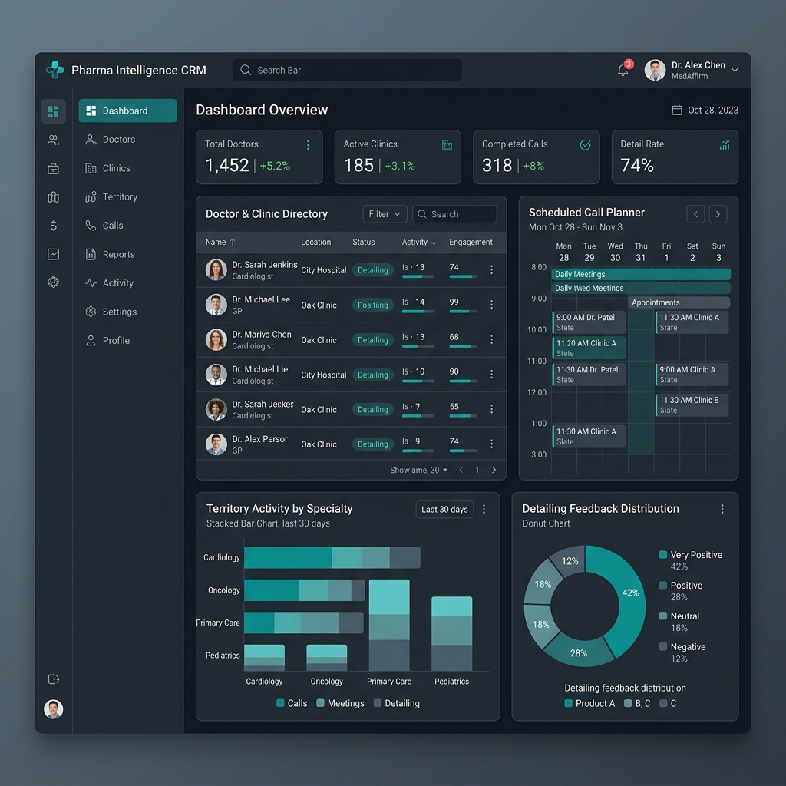
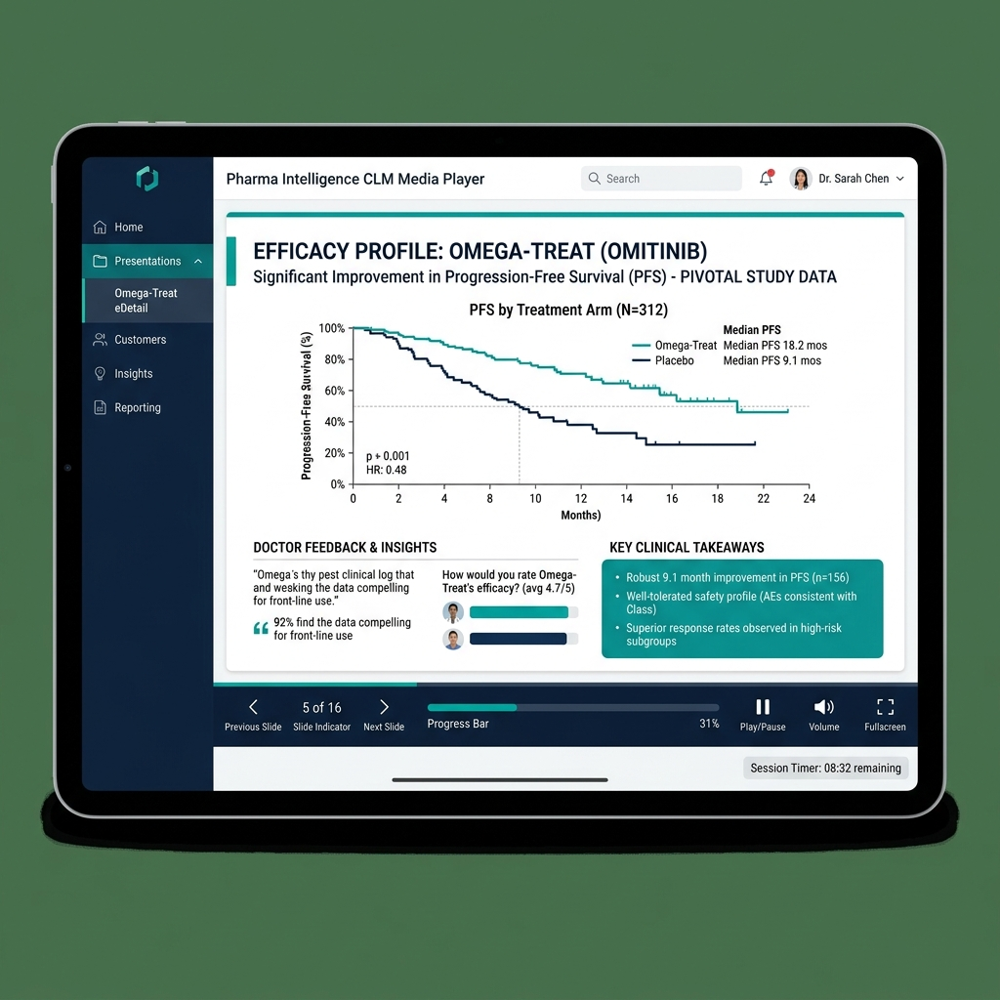
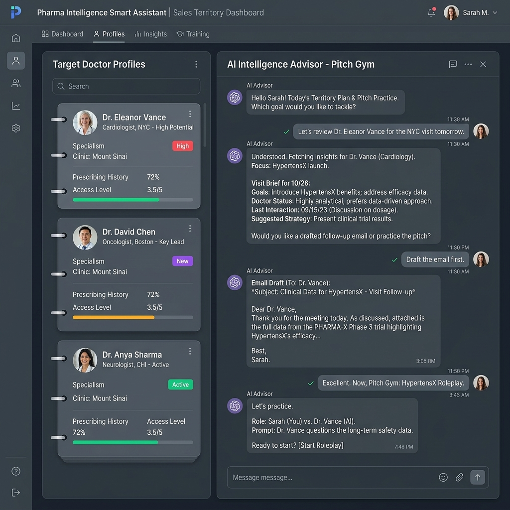

# Pharma Intelligence

Pharma Intelligence is a premium, high-fidelity pharmaceutical Customer Relationship Management (CRM) and Closed Loop Marketing (CLM) application. Designed for life sciences and field sales representatives, it provides a comprehensive suite of tools to plan territory visits, deliver interactive clinical presentations, track sample compliance, manage local medical events, and practice clinical pitches.

---

## Key Features

| Module | Description |
| :--- | :--- |
| **Territory Dashboard** | Real-time metrics tracking completed calls, segment reach rates, and detailing feedback distributions. |
| **HCP & HCO Directory** | Comprehensive directories of Healthcare Professionals (HCPs) and Organizations (HCOs) detailing therapeutic areas and schedules. |
| **Call Planner** | Calendar interface for scheduling visits, logging field calls, and registering starter pack distributions. |
| **CLM Media Player** | Interactive eDetailing player to present clinical drug slide decks and automatically compile compliance-certified call logs. |
| **Sample Inventory** | Live compliance tracker for medical sample batches, tracking allocations, and monitoring expiration dates. |
| **Event Manager** | Roundtable planning system to manage invitations, budgets, RSVPs, and speaker details. |
| **Field Sales Coach** | Smart assistant designed to generate tactical pre-visit briefings, draft follow-up emails, and coach reps via objection-handling roleplays. |

---

## Visual Walkthrough

### 1. Territory Execution Dashboard
Get a birds-eye view of field metrics, therapeutic target activity, and feedback analytics.


### 2. CLM Presentation Player
Deliver high-impact eDetailing slide decks with progression analytics and integrated compliance signatures.


### 3. Smart Advisor & Pitch Gym
Practice handled responses against simulated skeptical clinicians, generate doctor briefings, and draft custom follow-up emails.


---

## Getting Started

### Prerequisites
- **Node.js** (v18 or higher recommended)
- **npm** (v9 or higher)

### Setup & Installation

1. **Clone the repository and install dependencies:**
   ```bash
   npm install
   ```

2. **Configure your environment variables:**
   Copy the sample configuration file to create your environment configuration:
   ```bash
   cp .env.example .env
   ```
   Open the `.env` file and configure the required credentials and URL endpoints as defined in the template.

3. **Start the local development server:**
   ```bash
   npm run dev
   ```
   The application will run locally and serve the interface on port `3000`.

---

## Build and Deployment

To build the client bundle and bundle the backend server for production:
```bash
npm run build
```
To run the production build locally:
```bash
npm run start
```